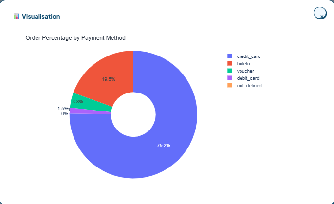
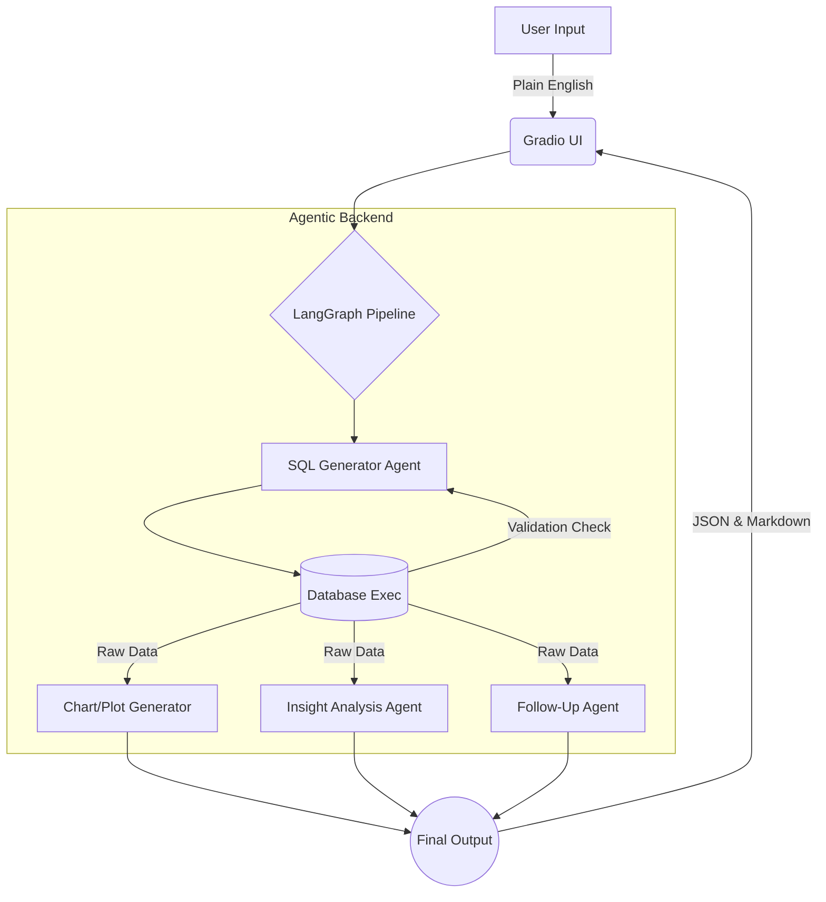

# 🔍 Olist Text-to-SQL Analyst

An AI-powered data analysis assistant that allows users to query the **Olist Brazilian E-commerce** dataset using natural, plain English. The application automatically translates questions into SQL, executes them securely, generates interactive visualizations, and provides deep analytical insights—all wrapped in a beautiful, responsive, Neo-brutalist web interface.


---

## ✨ Key Features

- **🗣️ Natural Language Interface:** Ask complex business questions without knowing SQL.
- **⚡ AI-Powered Pipeline:** Utilizes LangGraph and advanced LLMs to map queries to database schemas and generate accurate SQL.
- **📊 Automated Visualizations:** Automatically detects when data should be visualized and generates dynamic interactive charts.
- **🧠 Deep Insights:** The AI doesn't just return numbers; it analyzes the data and provides written business insights.
- **🔄 Dynamic Follow-ups:** Automatically suggests 3 context-aware follow-up questions based on the current analysis.
- **👨‍💻 Transparent Execution:** Users can click to view the exact SQL query generated by the AI to verify correctness.

---

## 📸 Interface Showcase

### 1. AI Analysis & Query Response
The application executes the query and returns a beautiful response card containing key insights and a detailed breakdown.


### 2. Interactive Charts
When the AI detects visualizable data (like trends or comparisons), it automatically generates interactive charts right in the chat.


### 3. Transparent SQL Viewing
Curious about how the AI got the answer? Click the "View SQL" button to see the exact query executed against the database.


---

## 🏗️ Architecture Flow

The backend is driven by a robust state machine built with **LangGraph**, ensuring reliable multi-step reasoning and error handling.



---

## 🚀 Getting Started

### Prerequisites
- Python 3.9+
- A configured environment with your preferred LLM API keys (e.g., OpenAI, Anthropic).

### Installation

1. **Clone the repository:**
   ```bash
   git clone https://github.com/yourusername/Olist-Text-To-SQL.git
   cd Olist-Text-To-SQL
   ```

2. **Set up a virtual environment (optional but recommended):**
   ```bash
   python -m venv venv
   source venv/bin/activate  # On Windows use: venv\Scripts\activate
   ```

3. **Install dependencies:**
   ```bash
   pip install -r requirements.txt
   ```

4. **Environment Variables:**
   Create a `.env` file in the root directory and add your API keys.
   ```env
   OPENAI_API_KEY=your_api_key_here
   GRADIO_SERVER_PORT=7860
   ```

### Running the App

Start the Gradio web server by running:
```bash
python app.py
```
The application will be accessible at `http://localhost:7860`.

---

## 🛠️ Tech Stack

- **Frontend:** [Gradio](https://gradio.app/) with custom Svelte CSS injections for a Neo-brutalist aesthetic.
- **State Management:** [LangGraph](https://python.langchain.com/v0.1/docs/langgraph/) for robust pipeline orchestration.
- **Database:** SQLite / PostgreSQL (Olist dataset).
- **LLM Integration:** LangChain.

---
*Text-to-SQL Agent Documentation*
